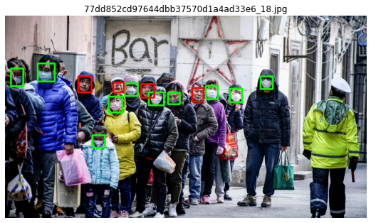

# Image Recognition for Covid-19

## Purpose 
The code, in a live video survelience detects the people show are not wearing a mask.


## Model
The model is made in pytorch. The architecture is a Resnet-50 Deep Neural Network, with a fully connected layer with dropout.


## Dataset
Medical-Mask-Dataset

## Running
```kaggle datasets download -d vtech6/medical-masks-dataset``` <br>
Unzip the `medical-masks-dataset.zip` to `kaggle/input/medical-masks-dataset` <br>

Run the cells of the notebook